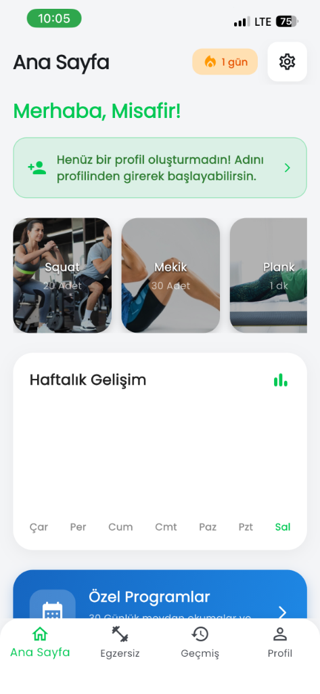
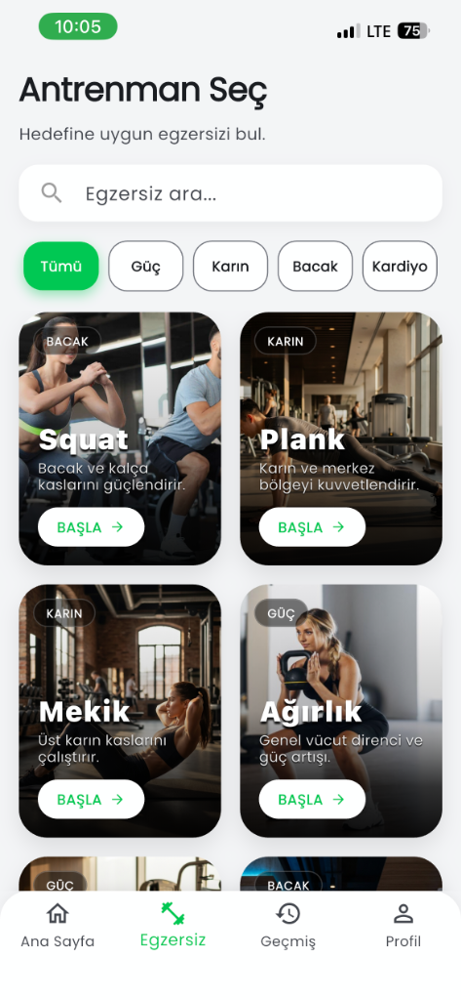
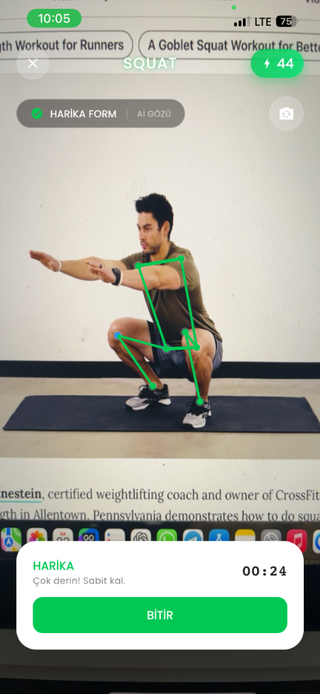
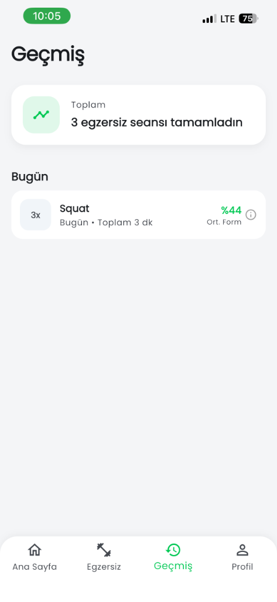
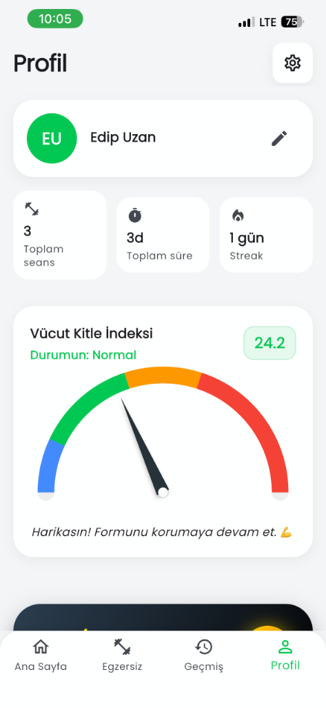

# Posturify


---

## 🇬🇧 English

**Posturify** is an AI-powered fitness assistant designed to analyze your exercise form in real-time. By leveraging computer vision on your mobile device, it detects your posture and provides instant voice feedback to ensure you are training correctly and safely.

### Why Use Posturify?

*   **Prevent Injuries:** Incorrect form is a leading cause of workout-related injuries. Posturify acts as a real-time spotter, warning you the moment your posture deviates from the safe range (e.g., "Keep your back straight").
*   **Maximize Efficiency:** Quality over quantity. The app's smart counter only registers repetitions that are performed with correct form, ensuring you get the full benefit of every movement.
*   **Train Anywhere:** No need for expensive equipment or personal trainers. Your phone's camera is all you need to get professional-grade form analysis at home or all the gym.

### Screenshots

| **Home** | **Selection** | **Live Analysis** |
|:---:|:---:|:---:|
|  |  |  |

| **Statistics** | **Profile** |
|:---:|:---:|
|  |  |

### Key Features

*   **AI Form Analysis:** Uses Google ML Kit Pose Detection to track 33 body landmarks at 30fps.
*   **Voice Assistant:** Provides immediate TTS (Text-to-Speech) feedback for corrective actions.
*   **Smart Counting:** Repetitions are counted logic-based, filtering out incomplete or bad reps.
*   **Gamification:** Earn XP, level up, and unlock badges to stay motivated.
*   **Privacy Focused:** All video processing happens on-device. No video data is ever sent to the cloud.

### Tech Stack

*   **Framework:** Flutter & Dart
*   **AI/ML:** `google_mlkit_pose_detection`
*   **Storage:** `hive` (NoSQL local database)
*   **State Management:** `ValueNotifier` & Services
*   **Navigation:** `auto_route`

### Installation

1.  **Clone the repo:**
    ```bash
    git clone https://github.com/edpuzn/Posturify.git
    cd Posturify
    ```

2.  **Install dependencies:**
    ```bash
    flutter pub get
    ```

3.  **Run (iOS/Android):**
    ```bash
    flutter run --release
    ```

---

## 🇹🇷 Türkçe

**Posturify**, egzersiz formunuzu gerçek zamanlı olarak analiz eden akıllı bir fitness asistanıdır. Telefonunuzun kamerasını ve görüntü işleme teknolojilerini kullanarak duruşunuzu takip eder, antrenman sırasında sesli geri bildirimlerle hareketleri doğru ve güvenli yapmanızı sağlar.

### Neden Posturify?

*   **Sakatlanmaları Önleyin:** Spor sakatlanmalarının en büyük sebebi yanlış formdur. Posturify, duruşunuz bozulduğu anda (örneğin "Sırtını dik tut") sizi uyararak sanal bir antrenör gibi çalışır.
*   **Verimliliği Artırın:** Sadece doğru formda yapılan tekrarlar sayılır. Bu sayede antrenmanınızdan maksimum verim alırsınız; yarım veya hatalı hareketler skora yansımaz.
*   **Her Yerde Antrenman:** Pahalı ekipmanlara veya spor salonuna ihtiyaç duymadan, sadece telefonunuzla profesyonel form analizi alabilirsiniz.

### Temel Özellikler

*   **Yapay Zeka Analizi:** Vücut eklem noktalarınızı saniyede 30 kare hızında takip eder ve analiz eder.
*   **Sesli Asistan:** Hatalı duruşlarda anlık sesli uyarı vererek duruşunuzu düzeltmenize yardımcı olur.
*   **Akıllı Sayaç:** Sadece nizami tekrarları sayar.
*   **Oyunlaştırma:** Egzersiz yaptıkça XP kazanır ve seviye atlarsınız.
*   **Gizlilik:** Tüm görüntü işleme cihaz üzerinde (on-device) yapılır, hiçbir görüntü sunucuya gönderilmez.

### Teknik Altyapı

*   **Framework:** Flutter & Dart
*   **Yapay Zeka:** Google ML Kit
*   **Veritabanı:** Hive (Yerel depolama)
*   **Durum Yönetimi:** ValueNotifier

### Kurulum

1.  **Projeyi indirin:**
    ```bash
    git clone https://github.com/edpuzn/Posturify.git
    cd Posturify
    ```

2.  **Paketleri yükleyin:**
    ```bash
    flutter pub get
    ```

3.  **Çalıştırın:**
    ```bash
    flutter run --release
    ```
